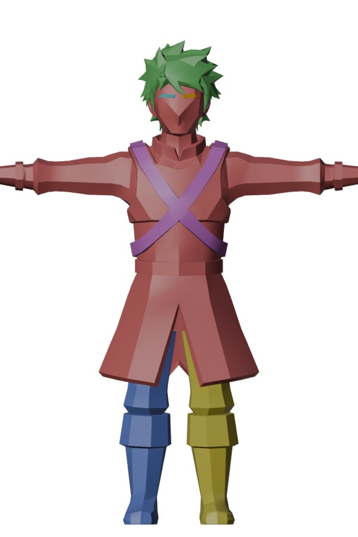
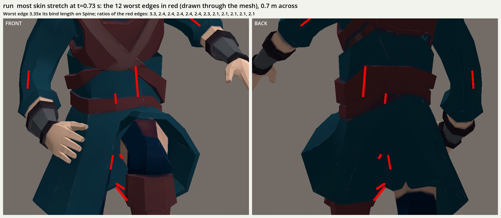
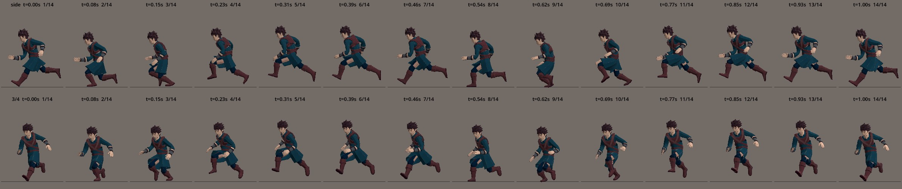
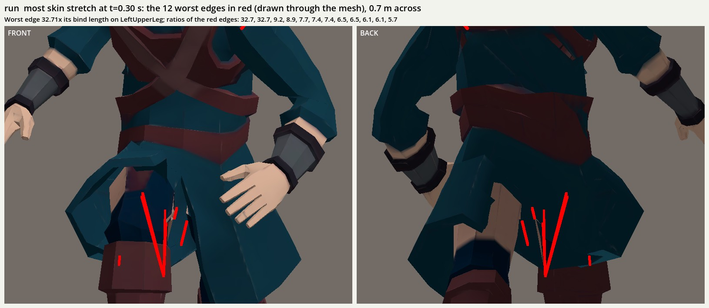
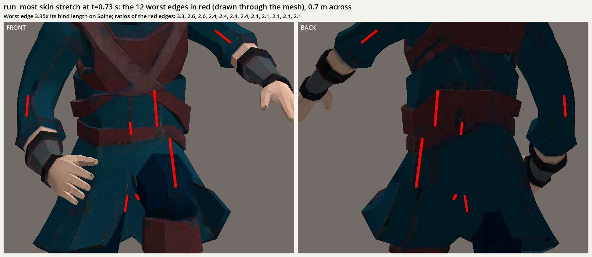

# Trial: body plus garment shells, with weight transfer (Phases 0 and 0b, 2026-10-02)

**Outcome: partly works, and not the way the item planned it.** On the paid P2 player (`player` attempt-2 and rig-2, built as the separate asset `player_p2parts`; the shipped P1 player is untouched), keeping the rig's own weights on the body shells and copying weights onto the garment shell from them closes every seam to under 1 cm and stretches less than P1 in 5 of 6 clips. The planned weight source, a voxel proxy of all the shells, fails: it fuses the legs at the crotch and stretches them 21–40×. Two acceptance checks still fail (poke-through at the collar, and the mesh judge's holes and colour assertions, which are P2's own). Spend: 0 credits.

## What P2 actually hands us

Nine welded shells (`shells_front.jpg`): 1 the body, tunic and arms in one piece (2,740 triangles), 2 the head and hair, 3–4 the legs and boots (they reach up inside the tunic without touching it), 5 the harness, 6–9 the eyes and brows. So P2's "garments" are mostly fused into the body; the only real garment shell is the harness.

## Two corrections to the A/B (`docs/trials/tripo-p2.md`)

- **The A/B's 7–14× stretch was mostly `skirt_reweight`, not the shells.** With the rig's own weights and no skirt reweight, P2 stretches 1.6–4.4×. On every shell, the skirt reweight catches the flared boot cuffs above `knee_z` and binds them to the thighs (13.6× in the run, `skirt_all_shells_run_stretch.jpg`): that's the A/B's "tearing at the boot tops".
- **The tear is real, but it's at the harness.** Edge stretch can't see a tear between shells, since no edge crosses one. A new seam-gap metric can (`scripts/review/seam_gap.gd`, in the motion review): with the rig's own weights, vertices that touch at bind on different shells come up to 6.7–14.9 cm apart. The worst pair is the harness belt's lower edge at the hip.

## Results (motion review, every clip; `run` at 5.0 m/s)

Each cell: edge stretch max (×) / seam gap max (cm) / vertices poking through their cover.

| Clip | P1 stretch | P2, rig weights | P2, proxy + Data Transfer | P2, proxy + inpaint | **P2, keep + transfer** |
|---|---|---|---|---|---|
| idle | 3.03 | 1.85 / 6.7 / 27 | 20.85 / 0.6 / 15 | 22.15 / 0.5 / 2 | **1.85 / 0.5 / 4** |
| run | 4.56 | 2.35 / 10.8 / 70 | 31.71 / 0.8 / 33 | 33.26 / 0.5 / 2 | **2.35 / 0.6 / 6** |
| dodge_roll | 3.88 | 4.38 / 13.9 / 54 | 26.54 / 0.9 / 21 | 28.16 / 0.5 / 5 | **4.38 / 0.6 / 4** |
| attack_light | 4.63 | 1.60 / 14.9 / 64 | 32.38 / 0.6 / 30 | 34.35 / 0.5 / 2 | **1.60 / 0.6 / 7** |
| attack_heavy | 4.98 | 3.22 / 12.9 / 73 | 37.69 / 0.8 / 35 | 40.05 / 0.5 / 2 | **3.22 / 0.6 / 7** |
| death | 3.61 | 2.42 / 10.9 / 59 | 28.48 / 0.7 / 17 | 30.97 / 0.5 / 0 | **2.42 / 0.7 / 5** |

**Keep + transfer** (the committed brief): shells 1–4 keep the rig's weights and are the source; the harness copies from them (Blender Data Transfer, `POLYINTERP_NEAREST`) and sits 4 mm out; the eyes are rigid on Head. With 4,437 triangles (budget 5,500) and one 256² texture, it's within budget. Run foot slide p90 is 0.55 m/s (P1 0.35; the A/B's 5.55 came from the tearing).

**The voxel proxy** (`bind: transfer` on shells 1–5, 1.2 cm voxels): it closes the seams, but the remesh fuses the legs where they nearly touch, so the inner thigh takes the other leg's weights (the legs' weights move by 0.54–0.63 at p90). It also comes out in 272 pieces, with only 67% in the largest. Inpainting (my reimplementation of Robust Skin Weights Transfer: matches within 2 cm and 35°, a seam-conflict test, a harmonic fill solved by conjugate gradients in numpy, and no scipy) fixes the poke-through but not the crotch. The proxy also loses interior shells, such as the legs inside the tunic, because they aren't on its envelope.

## Against the acceptance

| Check | Result |
|---|---|
| Edge stretch below P1 in every clip, ideally ≤ 1.0 | **5 of 6**; dodge_roll is 4.38 against P1's 3.88 (Spine: Tripo's own weights). None is ≤ 1.0 |
| Seam gap under 1 cm in every frame | **pass**: 0.52–0.71 cm (from 6.7–14.9) |
| No body vertex outside its garment | **fail**: 4–7 vertices, up to 4.6 cm. The worst is the body's collar coming out through the head shell's neck when the head turns (the body there is Shoulder/Neck/Head blended, the head shell is 100% Head). A few are the harness's own underside, which the metric's nearest-vertex test counts falsely |
| Mesh-stage judge passes | **not yet judged**. The packet has two failing assertions, so a pass would be recorded as escalate: 17 welded holes (limit 10; P2's open shells) and the dark navy concept colour covering 5.2% (limit 6.3%) |
| Triangle and texture budget | **pass**: 4,437 / 5,500, one 256² texture |

`hide_covered_body` removed only 2 faces. The harness straps are narrower than the torso's faces, so no face is fully covered.

## What it means

The industry pattern works when the source is a continuous body: garments copy from the body, and the body keeps its weights. The voxel proxy, which was meant to stand in for that body, was the wrong weight source. Phase 1's plan (segment plus complete into a body, tunic and boots, then rig the completed body) is that pattern: the completed body is the `keep` shell and the garments `transfer` from it, which is what this code does now. The remaining work is free: a transfer that blends from a shell's own weights to the source's near the contact, which would close the collar poke without dragging the hair onto the neck.

Reproduce: `python3 scripts/pipeline.py player_p2parts --stage all` (inputs in `.tripo-out/player_p2parts/`, copies of the player's attempt-2 and rig-2), then the motion review on `res://assets/meshes/player_p2parts.glb` with `--library res://data/animations/player_library.tres --ground-speed run=5.0`.

## Phase 0b (free; the judge escalated all 7 Phase 0 packets)

The judge's shared finding: the tunic follows the thighs, so the skirt opens at the crotch and the hem, and skin shows. Three changes, all in the committed brief:
- **Tunic graded:** `skirt_reweight` runs on the body shell only (part 1's `skirt: true`) and grades 187 vertices. The boot cuffs are no longer caught.
- **Head and legs are covers** (`cover: true`, a new part key). The 18 body faces they fully hide, mainly the collar inside the head's neck, are removed, so they can't poke through. `HIDE_RAY_M` went from 2 to 3.5 cm, because the neck sits 2.7 cm out.
- **Metric fix:** the poke test no longer counts a shell's backside facing the skin (the harness straps' undersides).

Each cell: stretch (×) / seam gap (cm) / poke-through vertices (worst, cm). The Phase 0 poke column used the old metric, so it includes the strap undersides.

| Clip | P1 stretch | Phase 0 | **Phase 0b** |
|---|---|---|---|
| idle | 3.03 | 1.85 / 0.52 / 4 (2.8) | **1.85 / 0.52 / 2 (0.5)** |
| run | 4.56 | 2.35 / 0.59 / 6 (1.6) | **2.35 / 0.59 / 4 (0.6)** |
| dodge_roll | 3.88 | 4.38 / 0.61 / 4 (3.2) | **4.38 / 0.61 / 2 (0.3)** |
| attack_light | 4.63 | 1.60 / 0.62 / 7 (2.1) | **1.96 / 0.62 / 4 (2.1)** |
| attack_heavy | 4.98 | 3.22 / 0.63 / 7 (4.6) | **3.22 / 0.63 / 5 (2.7)** |
| death | 3.61 | 2.42 / 0.71 / 5 (1.1) | **2.42 / 0.71 / 3 (1.1)** |

4,421 triangles. The collar is fixed. The 2–5 vertices left are all at one spot on the front chest straps (1.13 m), 2.85 cm from the nearest body vertex, where the nearest-vertex plane test is coarsest; they may be a metric artefact, and need a look in the strips. Stretch stays below P1 in 5 of 6 clips. Its peak is Tripo's own Spine weighting on the belt, not the tunic: grading the tunic didn't move the peak (attack_light rose 1.60 → 1.96, at Hips).

**The skin in the slit is texture, not weights.** The faces showing skin through the tunic slit are the leg shells' tops: Tripo painted 48 faces at 0.6–0.7 m in skin tones, where they're hidden at bind. The body shell has no skin-coloured faces there. Any slit that opens shows them, so the fix is an albedo overlay in the trouser colour (`p2parts-leg-top-albedo`). The death clip's final pose keeps its 1.40 m bind deviation, the same as P1's death.

**Mesh verdict follow-ups:** the faint face and the missing back straps are concept-level and unchanged. The "long spike edges" in the wireframe aren't defects. The longest edge on the cleaned GLB is 0.20 m (vertical boot-shaft edges; p99 0.153 m), and P1's is 0.187 m (p99 0.158 m).

**Recommendation:** start `player-model-rework` from P2 with the transfer (`player_p2parts`), once the leg-top albedo is fixed and the user has seen it in play next to P1. It holds together better than P1 at no further credit cost; its remaining defects are texture (leg tops, faint face) and concept (back straps). Phase 1 isn't needed for the weights.

## Leg-top albedo (`p2parts-leg-top-albedo`)

The new `scripts/make_shell_overlay.py` (deterministic; its sidecar hashes the UV source like the mouth overlay) paints the leg shells' faces at or above 0.55 m: 64 faces, 3,844 texels. They're painted in the median colour of the same shells between 0.45 and 0.54 m, the visible trousers, which comes to #071B2C. The clean stage composites it like the mouth line. A census of the cleaned GLB finds no skin-toned faces left on the legs or the body below 1 m (48 before). Weights and metrics are unchanged.

