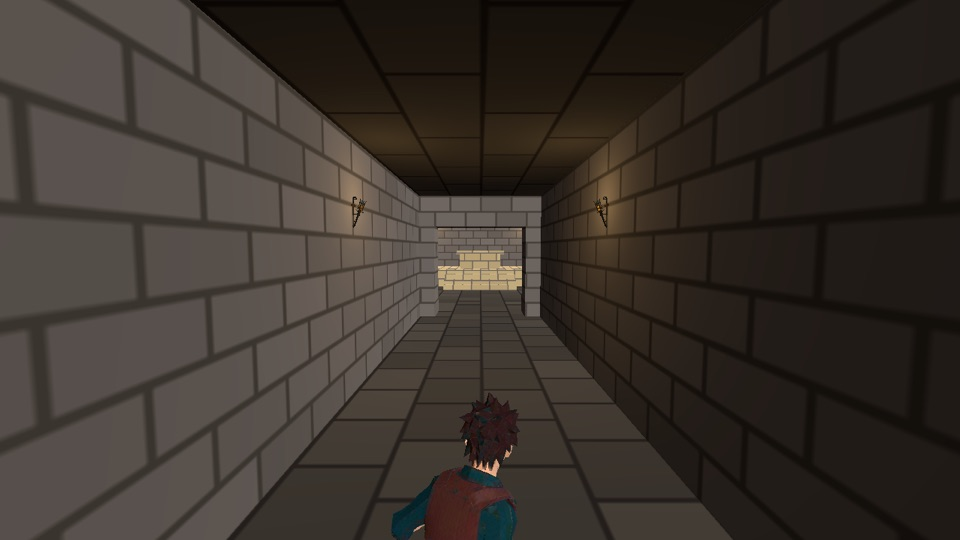
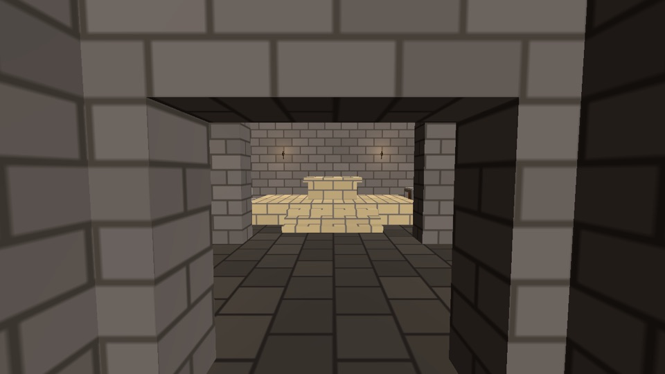
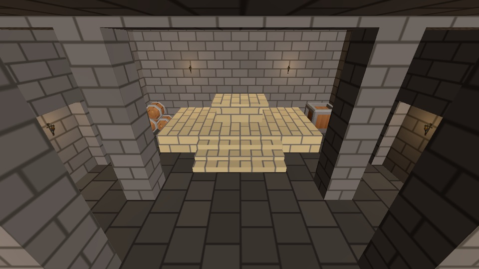
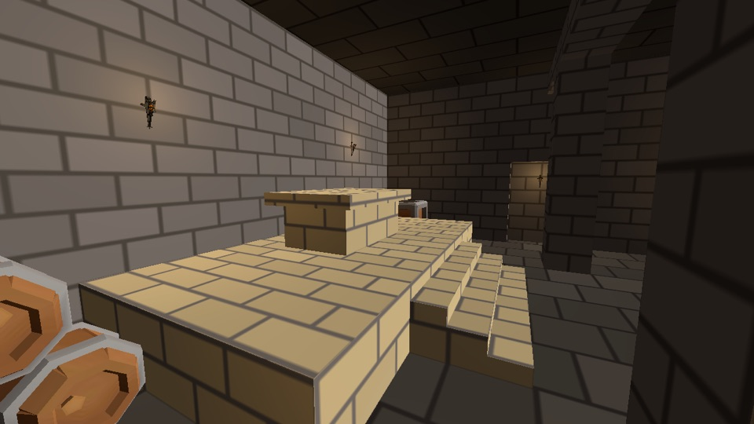
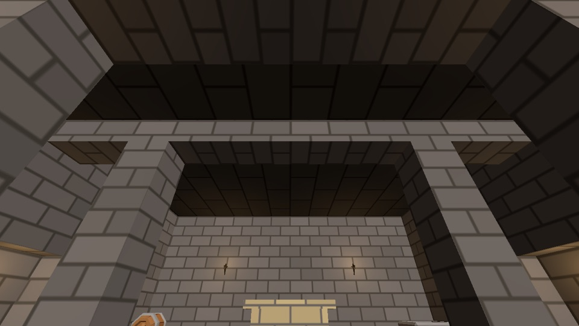
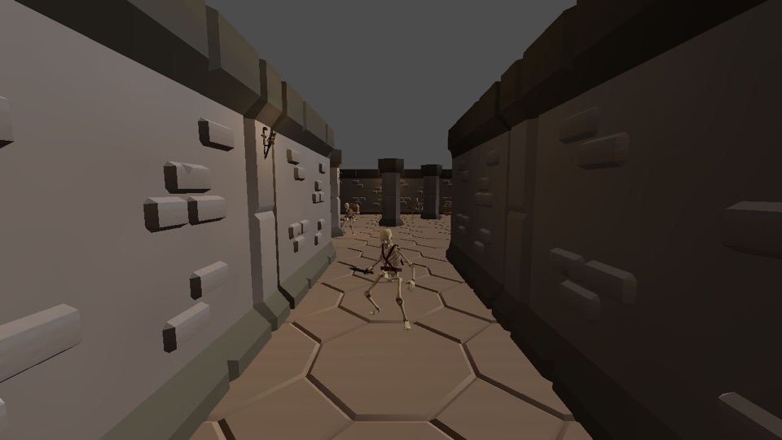
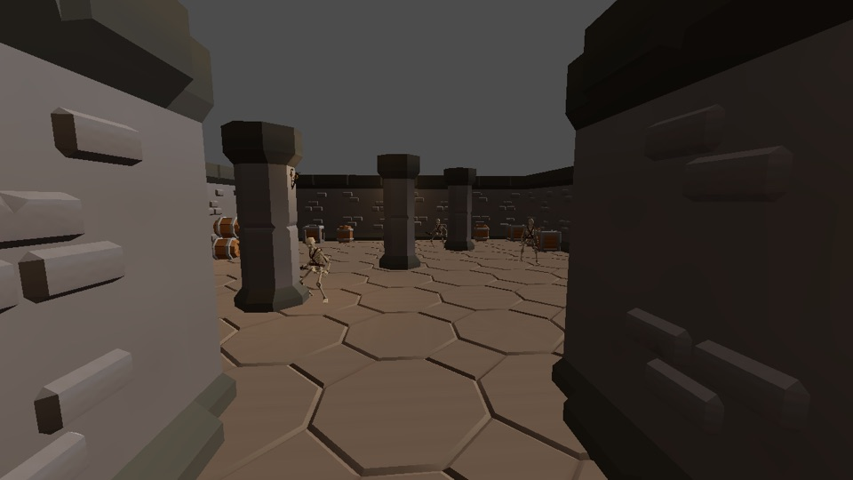

# Trial B2: func_godot and Quake `.map` crypt interiors

Phase B, step 6 of `docs/tools-review-2026-09.md`. **The question:** should crypt interiors be built as `.map` brushwork (func_godot), alongside the KayKit pieces or instead of them? **This is evidence, not the decision.** The user decides.

**Recommendation: keep, with changes.** Build each interior's **shell** from brushes: floors, walls, ceilings, steps, daises, niches and clip collision. Keep **kit pieces** for modelled detail (pillars, door frames, dressing). The changes needed are listed under "If kept".

## What was built

`scenes/world/trials/crypt_trial.map` is a plain-text Quake map, about 350 lines, at Level 1's scale (32 units per metre, 4 m grid). It contains 32 brushes and 8 torch entities:
- **Corridor:** 4 m wide and 12 m long, with a 4 m ceiling. It is its own `func_room` entity.
- **Doorway:** 3 m wide and 3 m tall, through a 1 m wall.
- **Hall:** 12 × 12 m with a 6 m ceiling. It has four pillars, two ceiling beams and a 0.5 m niche in each side wall.
- **Dais:** 1 m high across the north end. Three 0.25 m steps lead up to it, and an invisible `clip` ramp (26.6°) lies over them. The dais holds a sarcophagus.

`scenes/world/trials/CryptTrial.tscn` instances the built scene. It adds Level 1's environment and directional light, the player, four kit props and the HUD. Level 1 and Level 2 are unchanged.

| File | What it is |
|---|---|
| `addons/func_godot/` | func_godot **2025.12**, commit `169f2dd1461c0f166c81bf7e8c4fd6bce8af3a8a` (MIT), copied whole from the tag. It is **not enabled** in `project.godot`. |
| `data/maps/crypt_map_settings.tres` | The map settings, with the FGD and entity classes as sub-resources. `worldspawn` and `func_room` build a StaticBody3D with one mesh and one concave collision shape. `light_torch` instances `CryptTorch.tscn` and is in the `nav_ignore` group. Generated materials are never saved, and every PBR map pattern is cleared, so the build can't pick up a normal or roughness map. |
| `assets/textures/brush/` | `brush_material_template.tres` is the albedo-only template: StandardMaterial3D, specular 0, roughness 1. It sits beside four 128 px tileable placeholders in palette colours, written by `scripts/tools/make_brush_textures.py` (seeded and stdlib-only) until a texture source is chosen (trial B3). |
| `scripts/tools/build_brush_maps.gd` | The generator. It turns `.map` files into `*_brushes.tscn` headless. |
| `scripts/tools/bake_navmeshes.gd` | The baker now reads concave (trimesh) collision, skips `nav_ignore` decoration, and bakes the trial scene. |
| `tests/unit/test_crypt_trial.gd` | The budget, material, ceiling, doorway, collision and light-cap checks. |
| `tests/critical_paths/crypt_trial.json`, `tests/scenarios/crypt_trial_walk.json` | The path clearance check and the walk-through replay. The replay uses a new `reach_distance_m` check in `replay_metrics.py`. |

## Does it fit the pipeline? Yes, with no editor step

- **Build:** func_godot's import plugin only stores the `.map` text as a resource. The build itself is `FuncGodotMap.build()`, which is plain GDScript. `build_brush_maps.gd` runs it outside the tree from a headless `-s` script, with the plugin disabled, then moves the result under a plain Node3D. **The built scene doesn't depend on func_godot at runtime.**
- **Determinism:** two builds give identical files. Godot 4.7 gives every saved node a random `unique_id`, so the tool replaces each one with a hash of the node's path.
- **CI:** the navmesh job rebuilds the brush maps and fails on a stale build. It does this before the navmesh bake, which reads the built scenes. The stale check also covers the trial's navmesh. The cross-platform risk: if the Linux build's floats differ from the Mac's, the stale check fails. The first CI run is the test.
- **Navmesh:** 68 polygons from the concave collision faces. Level 1's and Level 2's bakes are unchanged byte for byte.
- **Path clearance (`lvl_path_clearance_min`):** every segment passes (corridor → doorway, doorway → stairs, stairs → dais). The narrowest is the stairs at 2.0 m; the doorway is 2.5 m.
- **Replay (`crypt_trial_walk`):** the player walks from the corridor start, through the doorway and up onto the dais. Two runs give identical logs. The player stops **0.29 m** from the target point on the dais, at a height of 1.9 m. **Without the clip ramp, the run fails at 3.04 m:** the capsule can't climb 0.25 m steps. On brushes the ramp is one brush; with kit stairs, it would be a hand-placed collision shape.
- **Logs:** the import and `load_all -d` runs show no new errors or warnings, so func_godot's scripts compile without warnings on 4.7.2. gdUnit4 (88 cases), the guard tests and the other replays still pass.

## Numbers against the design bible and the kit

| | Brush crypt (this trial) | Level 1 (KayKit) |
|---|---|---|
| Triangles, structure | **246** (hall 220, corridor 26; 192 m² of floor) | **52,378** (88 floor and wall pieces; a wall is 494, a doorway 1,068) |
| Exterior faces | textured `skip` (no mesh, no collision); this saved 76 triangles. `_cull_interior_faces` saved another 50. | n/a |
| `lvl_interior_ceiling` | **present** over every navmesh polygon (test). Corridor 4 m (target 3.5–4.5), hall 6 m (target 5–8). | none: the kit has no ceiling pieces |
| Doorway (2.2–3 m) | 3.0 m wide, 3.0 m tall (test) | the kit doorway's fixed size |
| `lvl_corridor_width_min` (≥ 3 m) | 4 m | 4 m |
| `lvl_verticality` | one 1 m rise (the dais) in about 20 m of path | 0 |
| `lvl_bare_wall_run_max` (≤ 8 m) | 6 m (the corridor walls and the hall's north wall, broken by torches; the hall's side walls are 5 m, broken by niches) | 16 m |
| `lvl_light_spacing` (8–12 m) | at most 7.5 m along the path | ≤ 12 m (test_level1_kit) |
| `lvl_landmark_visible` | yes: the dais and sarcophagus are lit at the end of the corridor (still 1) | no |
| `lvl_dressing_density` (1–3 per 10 m²) | not targeted: 0.6 in the hall (4 kit props, 4 pillars, the sarcophagus). The props are the same either way. | 0.14–0.20 |
| `lvl_floor_luminance_min` | not measured | not measured |
| Draw calls | one mesh per brush entity, one surface per texture (4 in the hall) | one mesh per piece |

## Look

For comparison, Level 1:

The stills come from `godot --path . res://scripts/review/level1_stills.tscn -- --out <dir> --shots crypt`, which runs windowed.

**The brush shell is enclosed and reads as a place.** Every frame has a ceiling, the exit and landmark are lit, and there is no grey background. **Its surfaces are flat, though:** all the detail is painted, so it reads closer to early Quake or PS1. **The kit has modelled relief** (raised blocks, chamfers and bevelled pillars) that brushes can't match cheaply, but it can't close a room. Better tileables (trial B3) would narrow the gap. That is why the recommendation is a mix: brush shell, kit detail.

## Authoring and review

- **What an agent writes and diffs:** the `.map`. A box brush is six plane lines, and `//` comments name each brush. **The built scene is base64 mesh data and isn't reviewable**; CI proves it matches the `.map`. A kit level's `.tscn` is diffable transforms, but it has to place about 90 pieces where brushes need 32, and it still has no ceiling.
- **Writing planes by hand is error-prone.** I wrote the boxes in metres and used a scratch helper of about 190 lines to emit the plane triples, with the winding checked against the brush centre. **A committed "boxes to brushes" helper would make agent authoring routine** (a follow-up).
- **TrenchBroom wasn't tested** because it isn't installed here. The map uses the Standard format with a `// Game:` header, and TrenchBroom should open it. On save, TrenchBroom rewrites comments as `// brush N`, so the names are lost; TrenchBroom layers and groups are how names survive.
- **Iterations it took:**
  - func_godot points a node's −Z along `angle`, so the torch scene faces −Z.
  - Exterior faces had to be textured `skip`.
  - A cyclic preload had to be worked around (below).
  - The corridor torches moved to break a 9 m wall run.

## Code read at import and editor time

- **No network calls**, no `OS.execute` and no telemetry anywhere in the addon.
- **Enabling the plugin** (`_enter_tree`) adds three `func_godot/*` settings, which end up in `project.godot` the next time the editor saves it. **This is the reason it stays disabled here:** nothing in this path needs it. It would be needed only for the editor's `.map`, `.wad` and `.lmp` importers and the "Build Map" node button.
- **Writes during a build:** `save_generated_materials` (default **true**) writes material `.tres` files into the texture folder. It is false in our settings.
- **Writes only when a person presses a button:**
  - FuncGodotLocalConfig writes `user://func_godot_config.json`.
  - The FGD and TrenchBroom or NetRadiant config export buttons write to folders chosen in that local config, which are **outside the project** (the map editor's games folder).
- **An upstream bug:** a cyclic preload (`func_godot_fgd_file.gd` → `func_godot_fgd_entity_class.gd` → `func_godot_util.gd` → `func_godot_map_settings.gd` → `func_godot_fgd.tres` → `func_godot_fgd_file.gd`). It fails with parse errors if an FGD-class resource is the first func_godot file a process loads. CI's `load_all` hit it. The workaround: our one settings file lists the map-settings script first, so it always loads first. Worth reporting upstream.

## Costs of adopting it

- **Maintenance:** about 4,800 lines of GDScript that we don't run except in one tool. Our own code is the generator (about 130 lines) and a 30-line extension to the baker.
- **Pinning risk: low.** The addon is pure GDScript with no GDExtension binary. Main is active, but 2025.12 has been the latest release for nine months (28 commits since).
- **Godot-upgrade risk: low to medium.** It uses 4.4+ features (typed dictionaries, `export_tool_button`), and the upgrade check is the brush stale build plus the tests.
- **Renderer cap:** one brush entity is one mesh, and the Compatibility renderer lights a mesh with at most 8 lights. Rooms therefore have to be split into `func_room` entities; the test enforces this.
- **How to pin it** (like gdUnit4 and godot-ai):
  - The tag and commit are recorded here and in the PR. `addons/func_godot/plugin.cfg` says `2025.12`.
  - **Never update it in place.** An update is a `chore/func-godot-<tag>` branch that replaces the folder wholesale from the tagged release, diffs it, re-reads the import and editor paths, and reruns the build, the stale checks, the tests and the replays.

## If kept (the "changes")

1. Add the proposed budget line to the art bible. It is in this PR as "proposed": ≤ 2,000 triangles per brush entity, albedo 128×128 per tileable. The number is the user's call; the test reads it from the art bible.
2. Commit a small box-to-brush helper for agent-written maps, and keep TrenchBroom for the human. Test the TrenchBroom round-trip, including the `clip`/`skip` textures it needs to display.
3. Replace the placeholder tileables with the chosen texture source (B3), keeping the albedo-only template.
4. Brush shells get kit detail: pillars, door frames and dressing as kit pieces, which the baker already reads.
5. Report the cyclic preload upstream.

**If the decision is drop:** delete `addons/func_godot/`, `data/maps/`, `scenes/world/trials/`, the brush textures, the generator and its CI step. The baker's concave-shape and `nav_ignore` support is harmless to keep. This note stays as the record.
