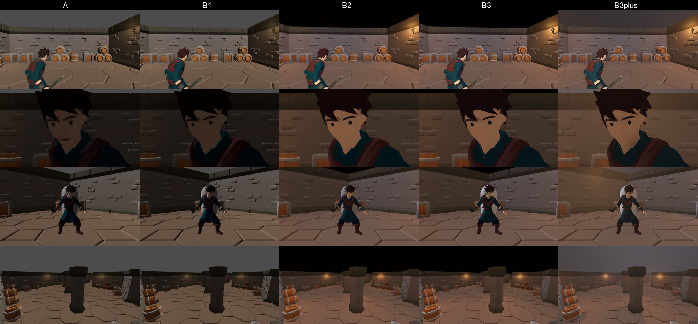
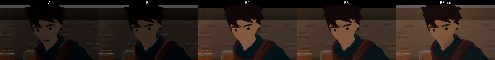
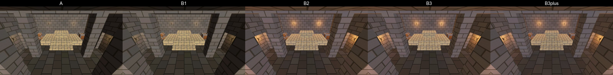
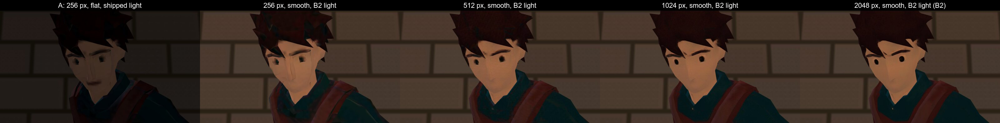

# Trial: look development, A today vs B limits lifted (2026-10-02)

**Outcome: the 256 px texture is what loses the face; smooth shading and better lighting are the next two wins, and Forward+ alone buys nothing visible.** The same P1 player (attempt-1, rig-1; no new generation) at 512 px or more, smooth-shaded, reads as a clean stylized character with eyes and brows, where today's 256 px flat-shaded build reads as smeared. The lighting pass (B2) is the biggest change from the gameplay camera, and stays in the Compatibility renderer. Forward+ (B3) looks the same as B2; its extras (B3plus: SSAO, volumetric fog, torch shadows) are subtle and cost the most. Every variant runs far inside 60 fps on this Mac. Spend: 0 credits. Nothing shipped changed: the variants are built into gitignored `assets/lookdev/` and applied at runtime by `scenes/lookdev/LookDev.tscn`.

**Recommendation (the user's call):** raise character albedo to **1024 px** (512 px as the floor), drop forced flat shading **on characters**, adopt B2-style lighting as the level standard, and **stay on Compatibility** until a C-type asset proves it needs Forward+. Then decide whether C (a PS3-class PBR player) is worth about 85 credits.



## The variants

| Variant | Player mesh | Lighting | Renderer |
|---|---|---|---|
| **A** (shipped) | `assets/meshes/player.glb`: flat shading over 30°, 256 px albedo with the mouth overlay | Level as shipped: ambient Wet Slate at 0.5, torches at 0.5 energy (range 5 m, attenuation 1), a white key, no tonemap, no fog | Compatibility |
| **B1** | `assets/lookdev/player_b1.glb`: the same rig-1 source through the clean stage with the **source's smooth normals kept** and the **source's 2048 px texture** (concept colour correction kept, mouth overlay left out since it's drawn at 256 px) | as A | Compatibility |
| **B2** | B1 | Ambient warm grey `#8F8073` at 0.8; filmic tonemap, exposure 1.15; depth fog `#1F1712` at density 0.03; torches warmer (`#FFB366`), energy 1.6, range 7 m, attenuation 1.6 (a steeper falloff); the key cooler (`#C7D6FF`) at 0.55; a near-black background instead of the default grey sky. The player's fill light is unchanged | Compatibility |
| **B3** | B1 | B2 | **Forward+** (`--rendering-method forward_plus` on the command line; the project setting is untouched, which was cleaner than a temporary project change) |
| **B3plus** | B1 | B2 + SSAO (radius 1.2, intensity 1.6), volumetric fog (density 0.01), shadows on every torch | Forward+ |

Shots, identical per variant: the gameplay camera as the player spawns, a face close-up (32° FOV, 0.8 m), a full-body 3/4 (45°, 3 m) and the room overview, in Level 1 (KayKit kit) and the crypt trial (brush shell). The player idles under `--fixed-fps 30`, so the pose matches frame for frame.

## Sheets (A | B1 | B2 | B3 | B3plus)

| Shot | Level 1 (KayKit) | Crypt trial (brush shell) |
|---|---|---|
| Gameplay camera | [level1_gameplay](look-dev/level1_gameplay.jpg) | [crypt_gameplay](look-dev/crypt_gameplay.jpg) |
| Face close-up | [level1_face](look-dev/level1_face.jpg) | [crypt_face](look-dev/crypt_face.jpg) |
| Full body, 3/4 | [level1_body34](look-dev/level1_body34.jpg) | [crypt_body34](look-dev/crypt_body34.jpg) |
| Room | [level1_room](look-dev/level1_room.jpg) | [crypt_room](look-dev/crypt_room.jpg) |

Turntables (the idle keeps playing): [A](look-dev/turntable_A.mp4), [B2](look-dev/turntable_B2.mp4). The other variants' clips are rebuilt by `scripts/lookdev/run_lookdev.sh`.




## Which rule change bought what

**Texture size: the face.** To separate texture size from shading, the same smooth-shaded mesh was also built at 256, 512 and 1024 px (`SIZE=… scripts/lookdev/build_b1.sh`), all under B2 lighting:



At 256 px the face is blotches even when smooth-shaded: the eyes smear into the brows and the nose becomes streaks. At 512 px the eyes, brows and jaw come back; 1024 px is close to indistinguishable from 2048 px at this distance. From the gameplay camera and the 3/4 shot ([texture_size_body34](look-dev/texture_size_body34.jpg)) the difference is small: the tunic and harness read at any size, and 256 px only shows as muddier edges. **So the user's "not even PS2" is mostly the close-up and dialogue distance, and it's the texture.**

**Smooth shading: the surfaces and the animation.** Smooth normals take away the crumpled facets on the cheeks, the tunic and the hands (B1 against A in the face and 3/4 sheets). It has a cost under today's lighting: at mid-distance the flat facets that face the fill light catch it, so A reads brighter and higher-contrast than B1 (turntable frame 40, the tunic and face). Smooth shading needs the B2 lighting to hold up, so the two changes go together. The art bible's reason for the rule (the Barrow-levy's belt "looked like a tube") was about hard-surface parts; it wasn't tested here, so the recommendation keeps the angle rule for props and kit pieces and lifts it for characters.

**Lighting (B2): the room and the gameplay camera.** This is the biggest change from the gameplay camera. The torches now throw visible warm pools with a falloff, the walls between them drop toward a warm dark, the far end of the room recedes in the fog, and the player reads warmer and less muddy against the floor. Compatibility draws all of it. The default grey sky over Level 1's ceiling-less rooms becomes near-black: Level 1 has no ceiling, which the crypt shell does.

**Forward+ (B3): nothing visible alone.** B3 differs from B2 by 0.3–0.4% RMSE in every shot (A to B2 is 6–15%). Forward+ only pays through the features Compatibility lacks (B3plus): SSAO grounds the crypt's pillars with a soft contact shadow on the floor and darkens the wall corners, and torch shadows add some depth, but both are subtle at these lighting levels (the crypt room moves 1.3% RMSE from B2). Volumetric fog at the same density as the depth fog washes out Level 1's open top. None of it is what the user was reacting to.

**Style consistency: the crypt shell over the KayKit kit.** Under B2 the crypt's brush shell and its Material Maker brick (crypt sheets) sit with the smooth-shaded player better than the KayKit room: its flat, chunky toy pieces (rounded barrels, bevelled crates, chamfered wall caps) are the "Roblox" read. The white capsule in the Level 1 3/4 shot is the Village Elder's placeholder mesh, which adds to it. This supports the brush shell plus a kit chosen in the target style (Phase C kit choice).

## Costs

**Per asset (the player):**

| Texture | GLB on disk | Extracted PNG | VRAM (S3TC, mipmaps) |
|---|---|---|---|
| 256 px (A) | 0.51 MB | 95 KB | 44 KB |
| 512 px | 0.69 MB | — | 175 KB |
| 1024 px | 1.39 MB | — | 0.70 MB |
| 2048 px (B1) | 3.43 MB | 3.0 MB | 2.80 MB |

At 1024 px, ten characters on screen are 7 MB of VRAM, which no target machine notices. Repo size is the real cost (each character GLB plus its extracted PNG roughly doubles). The triangle count doesn't change (4,893 in every variant), and smooth shading doesn't add vertices (it keeps the source's normals, so no welding).

**Frame time on this Mac** (Apple M2 Pro, windowed with `--always-on-top`, vsync off, 600 frames after a 120-frame warm-up; the median wall-clock frame in ms, gameplay camera / room overview). The viewport's GPU timer reads 0 on this Mac, so these are frame deltas:

| Variant | Level 1, 1280×720 | Level 1, 2560×1440 | Crypt, 1280×720 | Crypt, 2560×1440 |
|---|---|---|---|---|
| A | 1.1 / 2.5 | 2.1 / 4.2 | 1.9 / 1.7 | 2.4 / 2.9 |
| B1 | 1.6 / 3.2 | 2.2 / 4.5 | 2.0 / 1.7 | 2.5 / 2.8 |
| B2 | 1.8 / 3.4 | 2.1 / 3.9 | 1.3 / 1.2 | 2.8 / 3.3 |
| B3 | 1.3 / 0.9 | ≤ 8.3 (capped) | 1.8 / 1.7 | ≤ 8.3 (capped) |
| B3plus | 2.3 / 4.2 | ≤ 8.3 (capped) | 1.9 / 2.0 | ≤ 8.3 (capped) |

- Run-to-run noise is about ±1 ms (A's Level 1 gameplay frame was 2.1 ms in an earlier run), so A, B1 and B2 are the same within noise. Everything is far inside the 16.7 ms of `perf_fps_min` (60 fps).
- Forward+ at 2560×1440 locks to the display's 120 Hz (8.33 ms) even with `--disable-vsync` (driver-level sync on Metal), so it can't be resolved there; at 1280×720 it's uncapped and in the same range. Its p95 is worse (B3plus up to 11.3 ms in Level 1's room overview against A's 4.6 ms).
- Full numbers: [timing.json](look-dev/timing.json).

**What higher fidelity exposes.** Smooth shading and a sharper texture make the animation and skinning more visible, not less. The skirt's skin stretch (3–5×, `player-model-rework`) and any clip pops will read more plainly than they do through facets, and a lit room with falloff shows a stiff idle more than a flat one does. These are costs to budget for in `player-model-rework` and the motion gates, not reasons against.

## Proposed art-bible changes (for the user)

1. **Textures:** characters get one albedo at **1024×1024** (512 the floor), still albedo only. Props and kit pieces stay at 256 px until a sheet shows they need more.
2. **Shading:** continuous-skin characters keep the source's smooth normals; the flat-by-30° rule stays for hard-surface props, kit pieces and rigid-part characters (the Barrow-levy belt case).
3. **Rendering:** a level lighting standard like B2: a warmer ambient around 0.8, filmic tonemap, depth fog, torches with a range around 7 m and a steeper falloff, a dim cool key. Fog and tonemapping join the allowed list; bloom, SSAO and SSR stay out.
4. **Renderer:** stay on Compatibility. Revisit only if C is adopted, since PBR materials and their roughness and normal maps are what Forward+ would earn its keep on.

Proposed text for the art bible's Textures and Shading lines, if the user agrees:

> - **Textures:** albedo (base color) only, one texture per asset, or vertex colors. Characters 1024×1024 (512 minimum: at 256 the face smears, `docs/trials/look-dev.md`); props and kit pieces 128×128 to 256×256. No normal, roughness, metallic, occlusion, emissive or specular maps.
> - **Shading:** continuous-skin characters keep the generator's smooth normals. Props, kit pieces and rigid-part characters are flat-shaded wherever faces meet at more than 30°, and smooth below that (smooth-shaded hard surfaces read as inflated plastic: the Barrow-levy's belt looked like a tube).

## C, prepared but not run (PS3+ target, paid)

A player from Tripo's default high-detail model (v3.1) with PBR materials, from the **already-approved multiview sheet** (multiview-1), so no concept or multiview spend. The dry runs below are free (no network) and both returned `valid: true`:

```
tripo make .tripo-out/player/multiview-1/tripo-out/tripo-out-player-concept-1-tripo-e62305da/generate_multiview_image.front_view.jpeg .tripo-out/player/multiview-1/tripo-out/tripo-out-player-concept-1-tripo-e62305da/generate_multiview_image.left_view.jpeg .tripo-out/player/multiview-1/tripo-out/tripo-out-player-concept-1-tripo-e62305da/generate_multiview_image.back_view.jpeg .tripo-out/player/multiview-1/tripo-out/tripo-out-player-concept-1-tripo-e62305da/generate_multiview_image.right_view.jpeg --model v3.1-20260211 --param pbr=true --param texture=true -o .tripo-out/player_c/attempt-1 --no-open --json
```

- Dry run: `model: v3.1-20260211` (explicit), payload `{pbr: true, texture: true}` with the four views keyed front/left/back/right, no `face_limit` (the model's default, high-poly), no warnings or cost notes.
- Option: `--param texture_quality=detailed` (HD texture). Its dry run is valid but warns `texture_quality detailed: higher price tier`, so it needs the user's separate OK.
- Then the rig, as for P1 (rig-check free first): `tripo anim rig .tripo-out/player_c/attempt-1/tripo-out/<slug>/model.glb --rig-type biped --spec mixamo --out-format glb --param model=v1.0-20240301 -o .tripo-out/player_c/rig-1 --no-open --json`

**Estimate (unconfirmed for v3.1; nothing in the observed-cost table yet):** the model 30–60 (the pricing page's multiview row is 30 and P1 came in at 50), plus 10 for HD texture if chosen, plus the rig at 25 (observed): **about 55–95 credits, most likely about 85.** The balance is 420; this session's spend is 0 / 500.

What C needs besides the credits: a variant clean that keeps the PBR maps and the high triangle count (both break today's art-bible rules, so it lives under `assets/lookdev/` like B), Forward+ (or Compatibility with its simpler PBR) for the comparison, and a check that the v1.0 rigger accepts a mesh without a `face_limit`. Rendering it through `LookDev.tscn` is one more `--model` argument.

## Reproduce

```
scripts/lookdev/build_b1.sh                  # assets/lookdev/player_b1.glb (2048 px); SIZE=256|512|1024 for the others
scripts/lookdev/run_lookdev.sh               # every variant's stills, turntable and timings, then the sheets in .tripo-out/lookdev/sheets
```

The sources are the gitignored Tripo downloads in `.tripo-out/player/` (the builder falls back to the main checkout's). Windowed, on the Mac, hands off while it runs.
