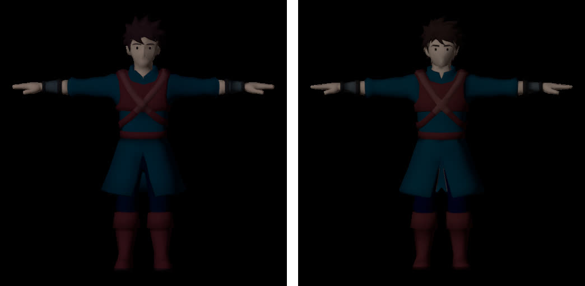
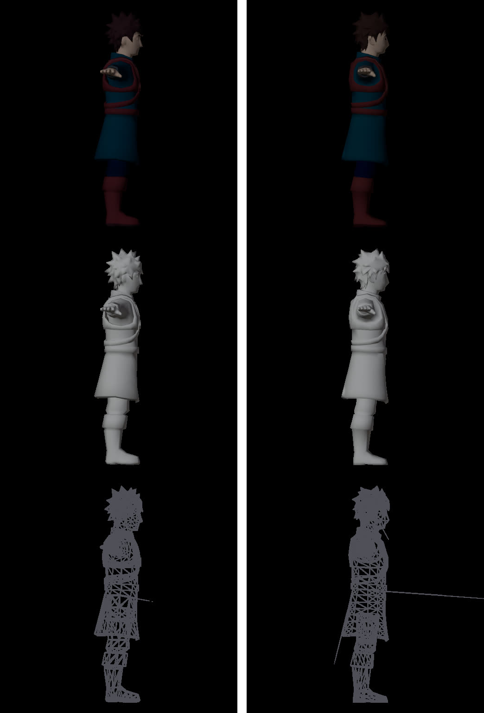
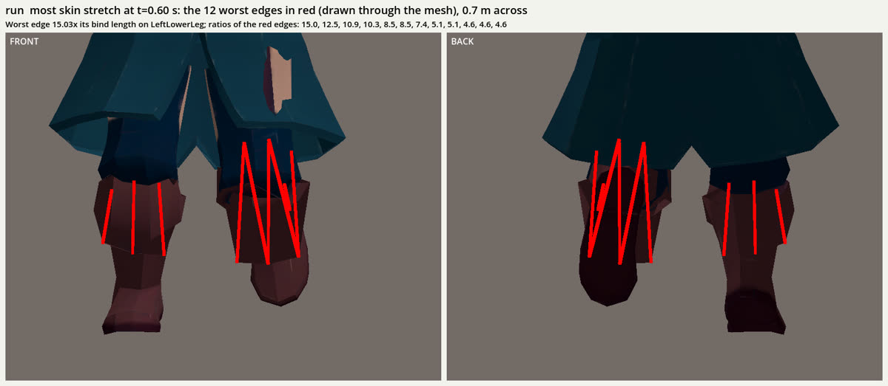
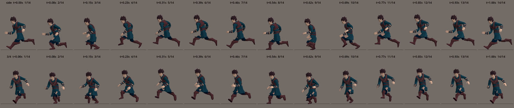

# Trial: Tripo P2.0 for the player (2026-10-02)

**Outcome: P1 stays.** P2's raw mesh is slightly tidier, but rigged and animated through our pipeline it tears at every seam, because P2 separates the model into shells. Nothing was merged; the shipped player is unchanged. The A/B branch `asset/player-p2-ab` was not pushed.

## What was run

Same approved inputs as the shipped player (concept-1 → multiview-1), same brief except `tripo_model`:

| | P1 (shipped, attempt-1) | P2 (attempt-2) |
|---|---|---|
| Model | `P1-20260311` | `P2-20260801` |
| Params | `pbr=false texture=true face_limit=5000` | same, no `quad` (quad forces FBX) |
| Cost | 50 (model) + 25 (rig v1.0) | **110** (model) + 25 (rig v1.0), CLI-reported = balance delta |
| Triangles (raw) | 4,893 | 4,439 |
| Welded parts | 5 | **9** (boots and tunic pieces as separate shells) |
| Rig-check | riggable biped | riggable biped |

The mouth overlay had to be regenerated for P2's UVs (`make_texture_overlay.py`, same settings).

## Results

Raw mesh, front (P1 left, P2 right): P2 has slightly cleaner hair clumps, chest straps, collar and boot tops; face and hands about the same.

Side, clay and wireframe: 

Motion review after clean (skin stretch, edge length vs bind; limit 1.0):

| Clip | P1 | P2 |
|---|---|---|
| idle | 3.03 | 6.83 |
| run | 4.56 | **14.03** |
| dodge_roll | 3.88 | 13.11 |
| attack_light | 4.63 | 11.14 |
| attack_heavy | 4.98 | 12.27 |
| death | 3.61 | 10.78 |

The run tears at the boot tops and splits the tunic, showing skin through the front (run foot slide p90 5.55 m/s, against P1's 0.35, most likely the tearing confusing the foot measure):

## Why

P2's part separation hands the rigger several shells; each is weighted on its own, and `skirt_reweight` assumes a tunic attached to one continuous body. P2's quality advantage shows in workflows that generate parts and assemble them by hand (e.g. Stefan 3D AI's P2 videos), which the user doesn't want.

## Next

A research spike on **body-only humanoids with separate clothing** (one continuous skin to rig, garments fitted by rigid binding or automatic weight transfer) is running; it decides whether P2 (or P1) gets another try in that form.
